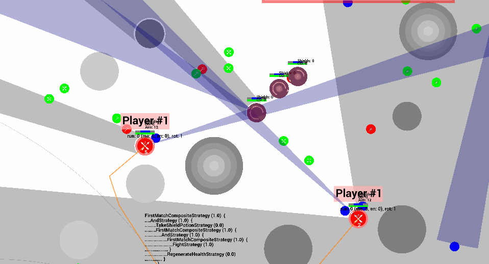
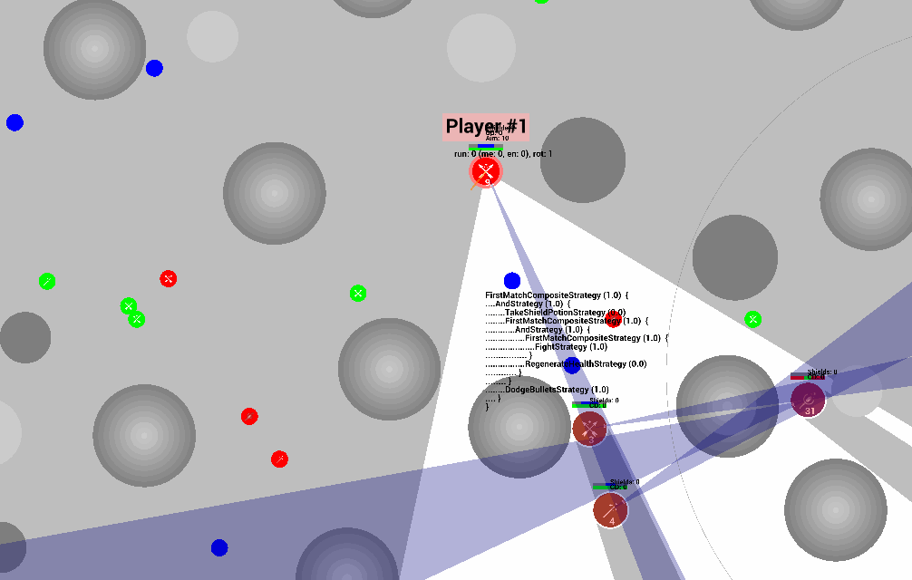
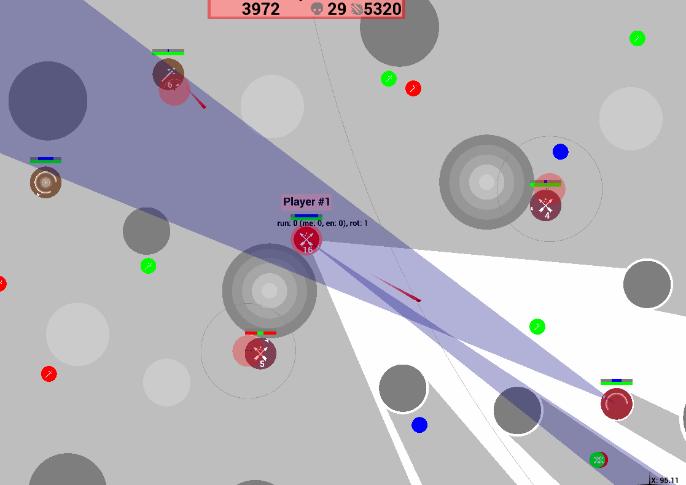
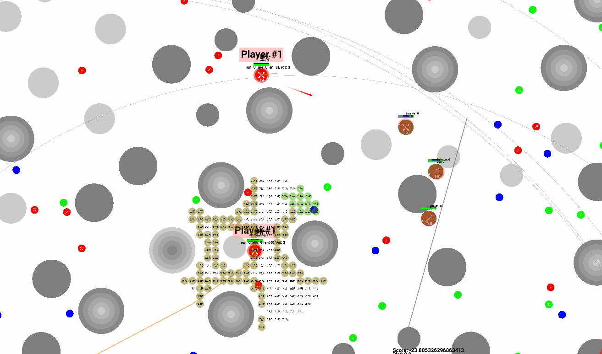
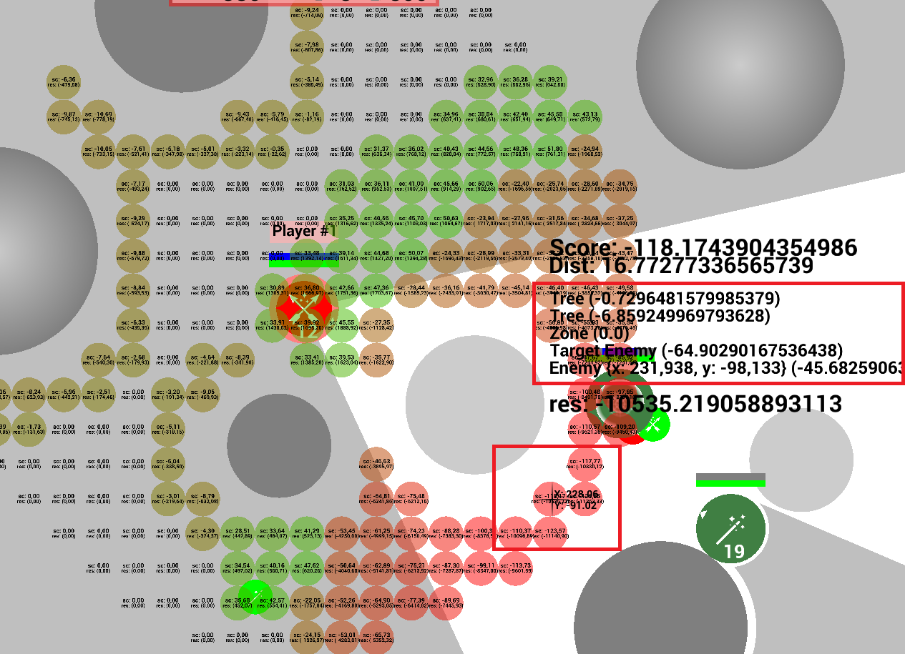

# [Russian AI Cup 2022](https://cups.online/ru/contests/coderoyale) (10th place) 

## TOC

* [Behaviour Tree](#behaviour-tree)
* [Уворот от снарядов](#Dodging)
* [Стрельба](#Shooting)
* [Звуки и фантомные юниты](#Sounds)
* [Потенциальные поля (ПП)](#pf)
* [Поиск пути](#Pathfinding)

## Стратегия

### Behaviour Tree

Действия юнитов определялись через Behaviour Tree.

Behaviour Tree выводился на экран. Получилось не супер информативно, но даже в таком 
виде это оказалось полезным в понимании того, что и почему сейчас делает юнит. :+1:

###  Уворот от снарядов

> _На гифке:_
> * _зеленый — направление, в котором можно уклоняться входя в прицел_
> * _желтый — направление, в котором следует выходить из прицела_
> * _оранжевый — направление, в котором нужно выходить из прицела и поворачиваться в эту сторону_

Уворот сделан через симуляцию. Симуляция происходит просто по заданным направлениям, без ветвления, 
на время жизни снарядов (или до их столкновения снаряда с деревьями). 

Юнит пытается увернуться:

* по 12 фиксированным направлениям вокруг себя
* по нормалям к траектории полета пули (только для лука и палки)
* по касательным к ближайшим препятствиям (чтобы не сталкиваться с ними)

Для каждого выше перечисленного пути симуляция делается 
* с прицелом
* без прицела 
* и с поворотом юнита в выбранную сторону (для увелечения скорости в этом направлении)

В качестве итогового направления выбирается направление 
1. с наименьшим суммарным полученным уроном 
2. если таких направлений несколько, то выбирается с лучшим скором на ПП

###  Стрельба

Точка, в которую лучше стрелять, определялась как середина между позициями, куда
может убежать враг, если будет идти перпендикулярно к траектории полета снаряда
(за время пока снаряд летит до него). 

Точки, куда может убежать враг, находились через симуляцию движения с учетом препятствий.
Это хорошо срабатывало, когда враг находится возле деревьев. :+1:

:-1: Пробовал стрелять на опережение в случаях, когда враг держит одинаковое ускоронение 
в течение двух тиков, но это немного снижало средний скор за игру.

:-1: Еще пробовал в случаях, когда во врага уже летит снаряд из лука, немного делеить выстрел
и искать возможность выстрелить так, чтобы у врага не было возможности увернуться сразу от
двух снарядов. Это срабатывало хорошо, но тоже снижало средний скор за игру.

В случае, когда враг находился за препятствием, прицел смещался так, чтобы разбросом 
не было возможности попасть в это препятствие.

###  Звуки и фантомные юниты

Вне поле зрения юниты определялись по:
* звукам шагов
* звукам выстрелов
* траекториям полетов снарядов, которые были сделаны из вне зоны видимости

При этом запоминалась позиция юнитов, их оружие и тик, когда был 
произведен выстрел.

Серые увеличивающиеся круги на гифке показывают куда теоретически мог убежать враг 
за время с тика, когда его было слышно последний раз. При повторных выстрелах по этому 
кругу определялось мог ли этот выстрел сделать тот же юнит или это уже другой.

###  Потенциальные поля (ПП)

Вся карта разделена на сетку размером 1х1. 

Каждый тик вокруг для каждого юнита брались ячейки из этой сетки в кругу радиусом 30 и для них
рассчитывалось ПП.

В ПП учитывались:
* расстояние до противника
* под каким углом стоит противник (мы можем подходить ближе, если противник отвернут от нас)
* есть ли прострел с данной ячейки на противника
* отдельный штраф для противников атакующих сзади или сбоку (чтобы отходить, если противники 
атакуют с нескольких сторон, и пытаться держать их все время перед собой)
* штраф для области около зоны
* небольшой штраф для зон вокруг деревьев, чтобы не подходить близко к ним
* штраф для области вокруг тиммейтов, чтобы не юниты не подходили друг к другу

Отрисовывается ПП очень долго, поэтому для тестов круга отрисовки ограничивался и была 
возможность переключаться между юнитами по клавишам.

И для каждой точки на ПП можно было посмотреть как именно получилось то или иное значение.
Но это ни разу не пригодилось :-1:

###  Поиск пути

Для поиска пути использовалась сетка из ПП, и по ней искался путь до ближайшей точки с помощью A*.
Чтобы путь не получался ломаным, он сглаживался (две доступные напрямую точки на пути соединялись).

Если необходимо бежать в сейве от противника (т.е. по пути, чтобы потенциально получить меньше
урона), то путь искался с помощью дейкстры, где вместо расстояния считалась сумма "штрафа" на ПП для 
этого пути, и вторым параметром учитывалась его длина.
